# Mapping JupyterLab's user interface to source code

Author: Gabriel Fouasnon

Date created: December 28, 2021

## Scope

JupyterLab loads a large number of front-end components into its default user interface. This document does not attempt to exhaustively map all parts of the interface to the source code. Rather it focuses on a subset of the UI. 

## Approach

I begin with the DOM tree and the UI. I hover over elements in the DOM using the browser's dev tools. I capture screenshots of these nodes. The rest of this document is organized by these chunks of the UI.

## Parts of the UI

### Application Shell

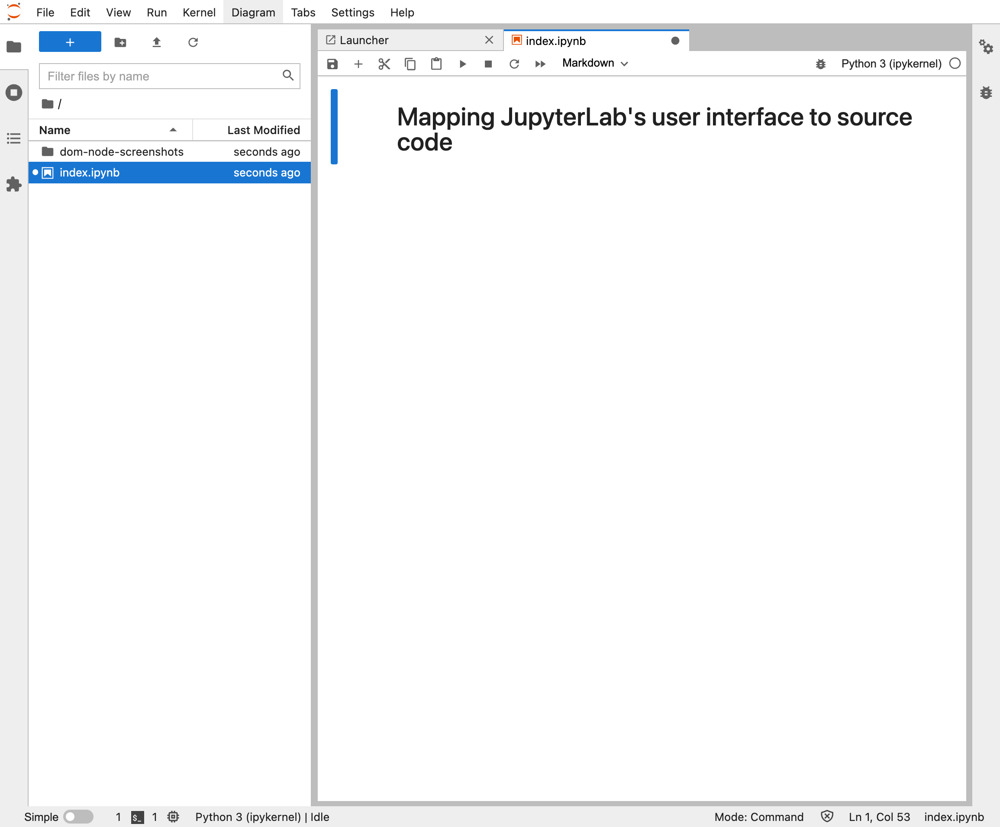

The application shell is the entire user interface of the application. It includes the top, bottom, and side bars, as well as the main content area.

DOM id = "main" (assigned in shell.ts)

CSS class = "jp-LabShell" (assigned in shell.ts)

It's hard to say where exactly the point of entry is for an application as big and complex as JupyterLab, but for my purposes, it looks something like this:

```javascript
// code snippet from juptyerlab/staging/index.js
  const lab = new JupyterLab({
    mimeExtensions,
    disabled: {
      matches: disabled,
      patterns: PageConfig.Extension.disabled
        .map(function (val) { return val.raw; })
    },
    deferred: {
      matches: deferred,
      patterns: PageConfig.Extension.deferred
        .map(function (val) { return val.raw; })
    },
  });
  register.forEach(function(item) { lab.registerPluginModule(item); });
  lab.start({ ignorePlugins });
```

JupyterLab class is defined in packages/application/src/lab.ts.
It inherits from JupyterFrontEnd defined in packages/application/src/frontend.ts, which in turn inherits from Application which is defined in @lumino/application.

The .start method is defined in the Application class. For each plugin (extension) that has been registered, it calls .activate() on that plugin, passing in the plugin's declared requirements to the activate function.

The JupyterLab class constructor creates a LabShell instance if one is not passed in. LabShell is defined in packages/application/src/shell.ts. The base Lumino Application class points `this.shell` to the LabShell instance. 

So `lab.shell` is essentially the root Lumino widget in the hierarchy of Lumino widgets. Within the JupyterLab source code, you will often see it invoked as `app.shell`.

So where does the shell get rendered and how does it get attached to the DOM? That happens in the Lumino Application class, in the start method. 

The shell.ts file is an important file. It defines several areas of the UI and provides a method, .add(), that allows extension developers to add new Lumino Widgets to the JupyterLab UI.

These are the areas that the shell defines:

- 'main'
- 'header'
- 'top'
- 'menu'
- 'left'
- 'right'
- 'bottom'
- 'down'

### Top Area


The top area includes the Jupyter logo and the main menu bar (File, Edit, View, etc).

DOM id = "jp-top-panel" (shell.ts)

role = "banner" (shell.ts)

shell area = "top"

```
shell._topHandler -> Private.PanelHandler -> 
  ._panel -> @lumino/widgets/panel{Panel}
```

How does it get attached to the DOM?

Shell.ts this.layout = rootLayout (@lumino/widgets/boxlayout)
rootLayout.addWidget(topHandler.panel); (path BoxLayout -> PanelLayout -> addWidget)


### Main Area

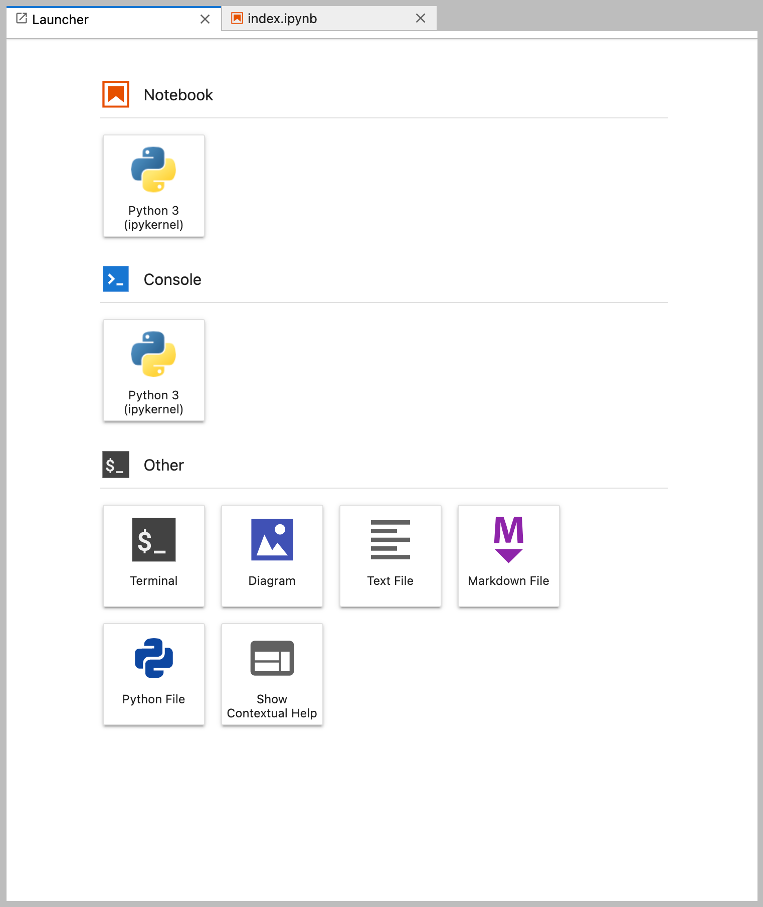

The main area is where documents are shown to the user to be read or edited. It's also where the launcher tab + page is rendered.

DOM id = "jp-main-dock-panel" (shell.ts)

role = "main" (shell.ts)

shell area = "main"

`shell._dockPanel` is an instance of DockPanelSvg instance of @lumino/widgets/dockpanel{DockPanel}


How does it get attached to the DOM?

rootLayout -> hboxPanel -> vsplitPanel -> hsplitPanel -> dockPanel

hpslitPanel.addWidget(dockPanel)
rootLayout.addWidget(hboxPanel)
hboxPanel = jp-main-content-panel
    vsplitPanel.addWidget(hsplitPanel);
    vsplitPanel.addWidget(downPanel);
    hboxPanel.addWidget(leftHandler.sideBar);
    hboxPanel.addWidget(vsplitPanel);
    hboxPanel.addWidget(rightHandler.sideBar);


### Bottom Area

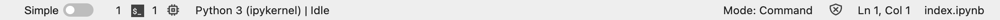

The bottom area contains the status bar.

DOM id = "jp-bottom-panel" (shell.ts)

role = "contentinfo" (shell.ts)

shell area = "bottom"

`shell._bottomPanel` 
rootLayout.addWidget(bottomPanel)

### Sidebar left


role = "complementary" (shell.ts)

aria-label = "main sidebar" (shell.ts)

```
leftHandler.sideBar
```

How does it get attached to the DOM? 
hboxPanel.addWidget(leftHandler.sideBar)

```
shell.add(widget, "left") ->
      this._stackedPanel.insertWidget(index, widget);
      const title = this._sideBar.insertTab(index, widget.title);
```

### Sidebar right

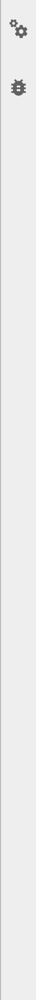

role = "complementary" (shell.ts)

aria-label = "alternate sidebar"

```
rightHandler.sideBar
```

How does it get attached to the DOM? 
hboxPanel.addWidget(rightHandler.sideBar)

```
shell.add(widget, "right") ->
      this._stackedPanel.insertWidget(index, widget);
      const title = this._sideBar.insertTab(index, widget.title);
```

### Menu area


The menu area contains the main menu bar (File, Edit, View, etc).

id = "jp-menu-panel" (shell.ts)

role = "navigation"

aria-label = "main"

```
_menuHandler.panel -> Lumino Panel
    if (this._dockPanel.mode === 'multiple-document') {
      this._topHandler.addWidget(this._menuHandler.panel, 100);
      titleHandler.hide();
    } else {
      rootLayout.insertWidget(3, this._menuHandler.panel);
    }
```

### Logo


### Main menu bar

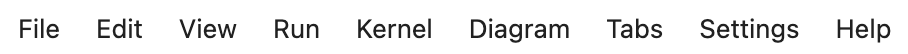

The main menu bar contais the menu items File, Edit, View, etc.

id = "jp-MainMenu"

```typescript
// mainmenu-extension 

plugin.activate

    const menu = new MainMenu(commands);
    menu.id = 'jp-MainMenu';


    app.shell.add(menu, 'menu', { rank: 100 });
```

MainMenu inherits from @lumino/widgets/menubar{MenuBar}

```
// @lumino/widgets/menubar
    content.setAttribute('role', 'menubar');
```

The MenuBar Lumino widget has a node (id=jp-MainMenu) as well as a content node (ul role="menubar")


### Menu item


A menu item is a clickable area labeled with text. It belongs to either a menu or a menu bar. For example, the word "File" in menu bar is menu item, and within the file menu, the word "New Launcher" is a menu item. Clicking a menu item either opens a sub-menu or executes a command.

role = "menuitem" (@lumino/widgets/menubar createItemARIA)

aria-haspopup = "true"

tabindex = 0 (ditto)

```
// @lumino/widgets/menubar
      return h.li(
        { className, dataset, tabindex: '0', onfocus: data.onfocus, ...aria },
        this.renderIcon(data),
        this.renderLabel(data)
      );
```

Where does the File menu item's `<li>` get mounted?

```
// @lumino/wigets/menubar
MenuBar
protected onUpdateRequest
    let content = new Array<VirtualElement>(menus.length);
    VirtualDOM.render(content, this.contentNode);

```

Whenever a menu (JupyterLabMenu which is RankedMenu which inherits from Menu) is added, this:MenuBar.update() gets called

mainmenu-extension plugin.activate loadSettingsMenu MainMenu.generateMenu() -> menu(MainMenu).addMenu -> MenuBar(Lumino).insertMenu -> .update() -> onUpdateRequest()

What about the New menu item?

Rendered within an absolutely positioned div, id = jp-mainmenu-file, whose id is set via the MenuFactory (menu.id = id). 

### (File) Menu

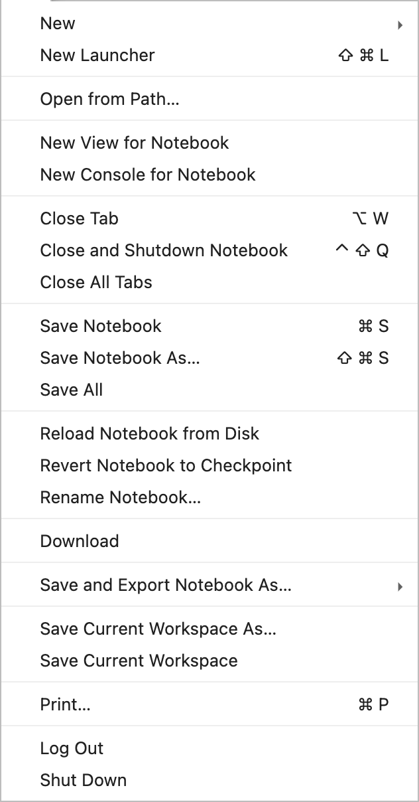

A menu is a group of menu items. Clicking a menu item either opens a sub-menu or executes a command. For this section, I will use the file menu as a concrete example.

DOM id = jp-mainmenu-file (set in menufactory.ts, line 61)

content node, ul[role = "menu"]

How is it mounted? For example:

```
MenuBar mouse down -> MenuBar _openChildMenu -> get activeMenu -> activeMenu:Menu.open() -> menu.openRootMenu -> 
    Widget.attach(menu, document.body);
```

### Left Tab Bar 

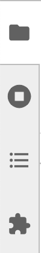

ul

role = "tablist" (@lumino/widgets/tabbar.ts)

aria-label = "main sidebar" 

aria-orientation = "vertical" (shell.ts)

```typescript
// this is SideBarHandler
      this._sideBar = new TabBar<Widget>({
        insertBehavior: 'none',
        removeBehavior: 'none',
        allowDeselect: true,
        orientation: 'vertical'
      });
```

```typescript
// shell.ts
    leftHandler.sideBar.contentNode.setAttribute(
      'aria-label',
      trans.__('main sidebar')
    );
```

How is it mounted?

shell.ts -> rootLayout.addWidget(hboxPanel) -> hboxPanel.addWidget(leftHandler.sidebar)

How is a tab within the tab bar mounted?

Very similar to a menu item in a menu or menu bar. 

TabBar -> addTab -> insertTab -> update -> onUpdateRequest -> renderer.renderTab -> VirtualDOM.render(content, this.contentNode)

this.contentNode is a  ul

How does the file browser tab get mounted?

filebrowser-extension -> plugins array -> browserWidget -> 
shell.add(browser 'left') ->
browser is of type FileBrowser (Widget)

The tab icon gets attached to the FileBrowser Widget in the "browser" plugin

```
// filebrowser-extension
    browser.title.icon = folderIcon;
```

### Tab bar tab


li

title = "File Browser (up x F)

get set by browser plug in

```
// filebrowser-extension
        browser.title.caption = trans.__('File Browser (%1)', ks);
```

role = "tab" (tabbar.ts)

aria-selected = "true" (tabbar.ts)

### Tab panel

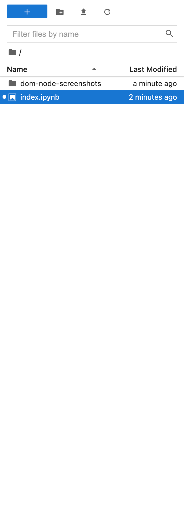

A tab panel appears when a tab is clicked in a tab bar. In this section, we will be looking at the file browser tab panel.

id = "filebrowser" (filebrowser/browser/FileBrowser constructor `this.id = options.id;`, which invokes Widget set id())

role = "region" (filebrowser-extension browser plugin activate())

aria-label = "File Browser Section" (filebrowser-extension browser plugin activate())

How is the file browser panel mounted?

filebrowser-extension browserWidget plugin activate 
labShell.add(browser, 'left')

After it's mounted it gets shown and hidden via a Signal from the TabBar
when currentIndex gets changed it calls `this._currentChanged.emit`
which gets picked up by `shell._leftHandler._onCurrentChanged`

```typescript
    private _onCurrentChanged(
      sender: TabBar<Widget>,
      args: TabBar.ICurrentChangedArgs<Widget>
    ): void {
      debugger;
      const oldWidget = args.previousTitle
        ? this._findWidgetByTitle(args.previousTitle)
        : null;
      const newWidget = args.currentTitle
        ? this._findWidgetByTitle(args.currentTitle)
        : null;
      if (oldWidget) {
        oldWidget.hide();
      }
      if (newWidget) {
        newWidget.show();
      }
      this._lastCurrent = newWidget || oldWidget;
      this._refreshVisibility();
    }
```

### Main panel


The main panel is where files, notebooks, terminals, consoles, and the launcher are shown. Multiple documents can be opened in the main panel at the same time. Each open document has a tab. You can show and hide various panels by clicking on the tab for that document. The main panel can be split vertically and horizontally so that a total of four open documents can be shown at once in the main panel.


id = "jp-main-dock-panel" (shell.ts:307)

role = "main" (shell.ts:337)

Mounted in shell.ts, `hsplitPanel.addWidget(dockPanel);`

### Main panel tab bar


A tab bar in the main panel allows you switch between open documents within a particular split of the main panel. 

The tab bar is created by @lumino/widgets/dockpanel `DockPanel._createTabBar` which delegages to .Renderer createTabBar method. It is of type @lumino TabBar. The TabBar class creates a container div and appens a content node ul.lm-TabBar-content[role=tablist]

Like the shell's left sidebar handler, it connects a currentChanged handler to the tab bar, so that when the tab changes, it can change the tab panel.

### Main panel document (tab panel)


Within each split of the main panel, only one document is shown at a time. For this example, we look at a notebook that's been opened in a main panel that has no splits.

role = "tabpanel" (docklayout.ts)

aria-labelledby = "tab-key-1" (docklayout.ts)

How is the tab panel shown and hidden? It's the same as with shell panel handler.

```typescript
// lumino/widgets/dockpanel
  private _onCurrentChanged(
    sender: TabBar<Widget>,
    args: TabBar.ICurrentChangedArgs<Widget>
  ): void {
    // Extract the previous and current title from the args.
    let { previousTitle, currentTitle } = args;

    // Hide the previous widget.
    if (previousTitle) {
      previousTitle.owner.hide();
    }

    // Show the current widget.
    if (currentTitle) {
      currentTitle.owner.show();
    }

    // Flush the message loop on IE and Edge to prevent flicker.
    if (Platform.IS_EDGE || Platform.IS_IE) {
      MessageLoop.flush();
    }

    // Schedule an emit of the layout modified signal.
    MessageLoop.postMessage(this, Private.LayoutModified);
  }
```

### Notebook body

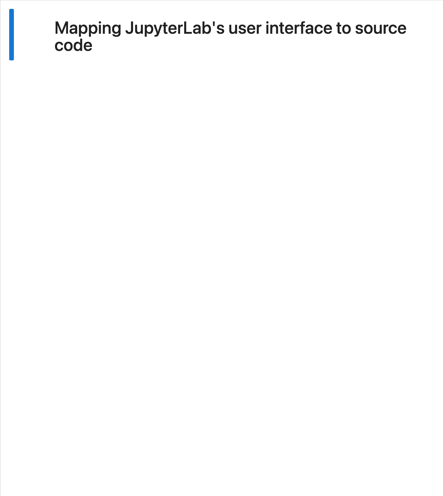

Odd. The containing widget for the notebook body plus its toolbar is a generic tabpanel controlled by DockPanel. Does that mean that there isn't a single widget managing both the notebook toolbar and the noteboody body? 

The body without toolbar is a div.jp-NotebookPanel

role = "region" (apputils/mainareawidget)

aria-label = "notebook content" (apputils/mainareawidget)

This is odd. It looks like everything opened in the main area has the aria label "notebook content." I verified this on a png as well as the launcher.

Looks like it is mounted by the docmanager extension.

```typescript
          app.shell.add(widget, 'main', options || {});
```

### Notebook toolbar


The notebook toolbar contains buttons to perform actions on the notebook, such as copy, paste, save.

role = "navigation" (notebook/panel.ts)

aria-label = "notebook actions" (ditto)

class = "jp-NotebookPanel-toolbar" (ditto)

How is it mounted?

Looks like it is mounted in the MainAreaWidget constructor.

```typescript
    layout.addWidget(toolbar);
```

### Notebook toolbar item

tag = button

title = "Save and create checkpoint (⌘ S)"

Created by `createSaveButton` function in docmanager-extension.

How is it mounted?

The relevant code is in ABCWidgetFactory

```typescript
// docregistry/default/ABCWidgetFactory
  createNew(context: DocumentRegistry.IContext<U>, source?: T): T {
    // Create the new widget
    const widget = this.createNewWidget(context, source);

    // Add toolbar items
    let items: DocumentRegistry.IToolbarItem[];
    if (this._toolbarFactory) {
      items = this._toolbarFactory(widget);
    } else {
      items = this.defaultToolbarFactory(widget);
    }
    items.forEach(({ name, widget: item }) => {
      widget.toolbar.addItem(name, item);
    });

    // Emit widget created signal
    this._widgetCreated.emit(widget);

    return widget;
  }
```

The docmanager calls this function on an instance of NotebookWidgetFactory which inherits from ABCWidgetFactory. The NotebookWidgetFactory produces a NotebookPanel widget inherits from DocumentWidget inherits from MainAreaWidget. MainAreaWidget creates a toolbar of type Toolbar (not Lumino ToolBar) inherits from Lumino/Widget and uses jupyterlab/ToolbarLayout (Lumino/PanelLayout). The toolbar provides the addItem method, which eventually puts the node on the DOM via the Lumino/PanelLayout insertWidget -> attachWidget.

### Status bar


id = jp-main-statusbar (statusbar-extension)

backed by instance of StatusBar (Widget)

How is it mounted?

statusbar-extension

```typescript
    app.shell.add(statusBar, 'bottom');
```

### Status bar panel

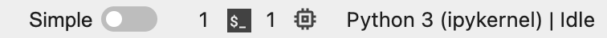

The StatusBar class defines three panels: left, middle, and right.

The StatusBar constructor mounts these three panels.

### Status bar widget

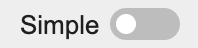

In this section, we will examine the document mode toggle.

id = jp-single-document-mode (statusbar-extension modeSwitch plugin)

backed by instance of Switch class (ui-components/switch.ts)

It gets added to the status bar by the following code

```typescript
    statusBar.registerStatusItem(
      '@jupyterlab/statusbar-extension:mode-switch',
      {
        item: modeSwitch,
        align: 'left',
        rank: -1
      }
    );
```

when {align: 'left'} is passed to registerStatusItem, then `statusBar._leftSide.addWidget` gets called which delegates to the addWidget method of Panel (Lumino).

### Context menu

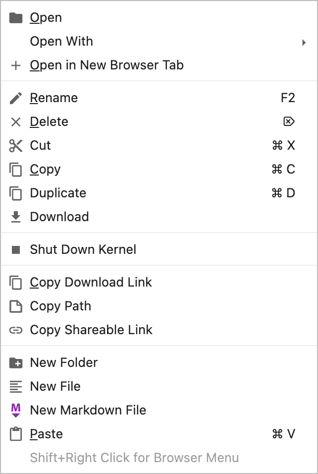

The context menu is a menu that pops up next to where a user right-clicks on a mouse. 

The context menu is fairly straightforward. The main app instance inherits from Lumino Application class which binds to the 'contextmenu' event. JuptyerLab subclasses the Lumino ContextMenu class. The context menu constructor takes in the app's commands. When a user right-clicks, the event handler calls menu.open, which loops through all of the commands and selects those which are matched by a CSS selector. Commands are paired with CSS selectors in JSON schemas.